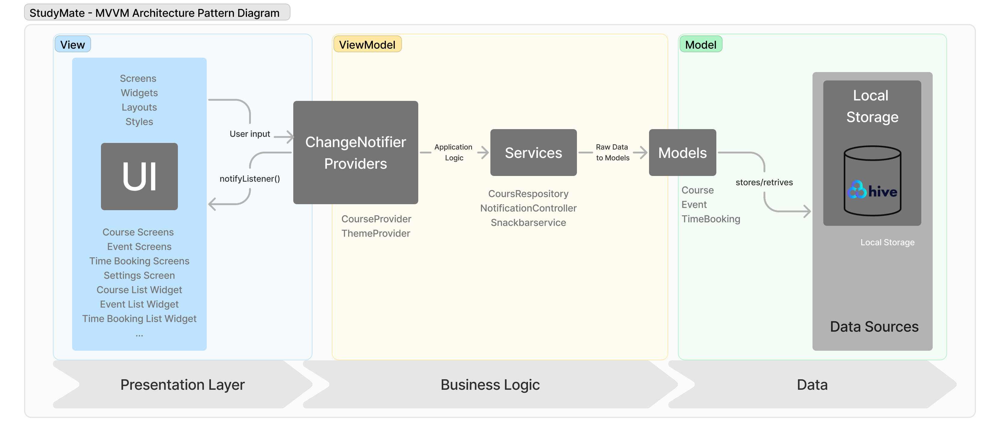
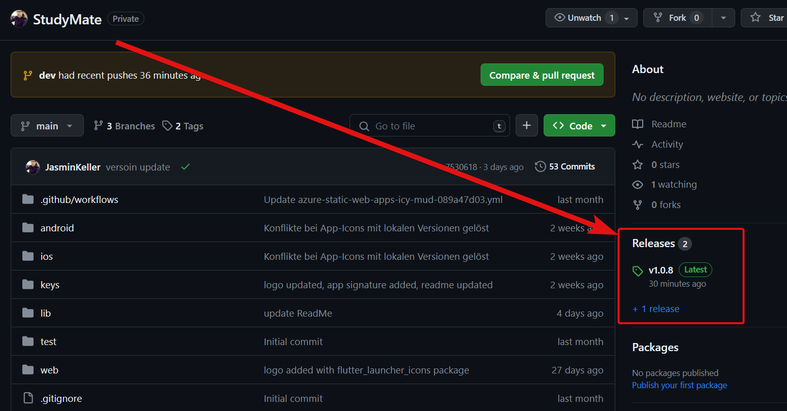

# StudyMate - Zeitmanagement-App für Studierende

## Setup für die Entwicklung auf Android
Um dieses Projekt im Entwicklungsmodus auf einem Android-Gerät zu starten, folge bitte diesen Schritten:

1. Stelle sicher, dass du Flutter und Dart auf deinem System installiert hast. Wenn nicht folge den Anweisungen auf der [offiziellen Flutter-Website](https://flutter.dev/docs/get-started/install).
2. Klone das Repository auf deinen lokalen Computer.
3. Führe `flutter pub get` im Projektverzeichnis aus um alle Abhängigkeiten zu installieren.
4. Öffne das Projekt in deiner bevorzugten IDE (z.B. Android Studio oder VS Code).
5. Starte einen Emulator oder schliesse ein physisches Android-Gerät an.
6. Führe `flutter run` im Terminal aus um das Projekt zu starten.

## Architektur und State-Management

Die Struktur dieses Projekts folgt keinem expliziten Architektur-Pattern, sondern adaptiert Prinzipien, die meiner Arbeitsweise am besten entsprechen. Dennoch ähnelt die verwendete Struktur dem MVVM-Muster:

- `Screens` als Views für die Darstellung der Benutzeroberfläche.
- `Providers` als ViewModels, die das State-Management übernehmen bzw. die UI mit der Business Logik verbinden.
- `Services` als Model, welche die Geschäftslogik enthält.

Die Architektur der App ist in verschiedene Verzeichnisse aufgeteilt:

- `entity`: Enthält Datenmodelle, die die grundlegenden Datenstrukturen der App repräsentieren.
- `providers`: Beinhaltet die State-Management-Logik mit Flutter's Provider-Paket.
- `screens`: UI-Komponenten der App, aufgeteilt nach Funktionalität in `course`, `event` und `time_tracking`.
- `services`: Service-Klassen, die die Geschäftslogik und die Kommunikation mit externen Datenquellen handhaben.
- `theme`: Enthält die themenbezogene Konfiguration und Styling-Informationen.
- `utils`: Hilfsklassen und Funktionen.
- `widgets`: Wiederverwendbare Widget-Komponenten, die in den Bildschirmen verwendet werden.

## Architecture Pattern Diagram

## Vertiefungsthema "Store Releases"

Als Vertiefungsthema wurde das Thema "Store Releases" gewählt. Dabei wurde versucht, die App im Google Play Store zu veröffentlichen. 

Unter folgendem [Link](https://jake-knowledge.notion.site/Store-Releases-1c57569a2c564be9b6cf3ea83cc26376) (tbd) habe ich die Einzelheiten dokumentiert, für diejenigen, die daran interessiert sind.

Bitte sei dir folgender Punkte schon vorab bewusst: 

- Du brauchst einen Google Developer Account, der einmalig 25$ kostet.
- Du musst deine Identität bestätigen.
- Du musst Screenshots für ein Tablet in genauer Grösse und Proportion angeben.
- Du brauchst einen Link zu deiner Datenschutzerklärung.
- Bevor du die App online bringen kannst, musst du einen geschlossenen Test mit 20 Testern durchführen, der 2 Wochen aktiv läuft.

Die Veröffentlichung einer App im Store ist ein komplexer Prozess, der sorgfältige Planung und Vorbereitung erfordert.

## Continuous Integration and Delivery (CI/CD) Workflow

Der CI/CD-Workflow wird durch GitHub Actions automatisiert und ist für die Überprüfung des Codes und das Bauen der App zuständig. 
Dieser Workflow wird durch Pushes in die `main`- und `dev`-Branches ausgelöst.

### Was macht der Workflow?
- **Checkout**: Klont den Code für den Build.
- **Setup Java**: Konfiguriert die Java-Umgebung, die für den Build erforderlich ist.
- **Flutter Action**: Stellt Flutter zur Verfügung und wählt die richtige Version für den Build aus.
- **Dependencies**: Lädt alle Abhängigkeiten herunter.
- **Build**: Erstellt die APK-Datei der App.
- **Release**: Lädt die gebaute APK als ein Artefakt hoch und erstellt ein Release-Tag.

Die APK kann man hier herunterladen:

Es werden spezifische APKs für unterschiedliche Prozessorarchitekturen generiert, um eine optimale Performance sicherzustellen:
- `app-arm64-v8a-release.apk`: Für neuere Geräte mit 64-Bit ARM Prozessoren.
- `app-armeabi-v7a-release.apk`: Für ältere Geräte mit 32-Bit ARM Prozessoren.
- `app-x86_64-release.apk`: Für Geräte mit x86_64 Architektur, wie z.B. einige Android-Emulatoren.

Der vollständige CI/CD-Prozess bis zur Veröffentlichung im Google Play Store wurde noch nicht umgesetzt, da die App sich aktuell im geschlossenen Test befindet.

Interessierte, die mehr über den Automatisierungsprozess von App-Builds und -Releases lernen möchten, sollten sich das Video "Flutter App Deployment - Leverage Codemagic CD to publish your app to Google Play Store" auf [YouTube](https://www.youtube.com/watch?v=mg8_pM7sGM8) ansehen, das eine detaillierte Anleitung bietet.

