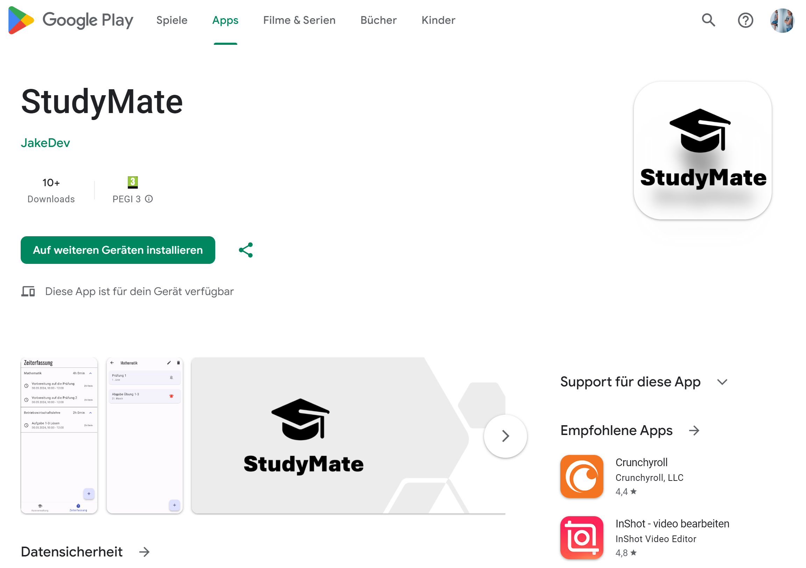

# StudyMate - Zeitmanagement-App für Studierende

## Setup für die Entwicklung auf Android
Um dieses Projekt im Entwicklungsmodus auf einem Android-Gerät zu starten, folge bitte diesen Schritten:

1. Stelle sicher, dass du Flutter und Dart auf deinem System installiert hast. Wenn nicht folge den Anweisungen auf der [offiziellen Flutter-Website](https://flutter.dev/docs/get-started/install).
2. Klone das Repository auf deinen lokalen Computer.
3. Führe `flutter pub get` im Projektverzeichnis aus um alle Abhängigkeiten zu installieren.
4. Öffne das Projekt in deiner bevorzugten IDE (z.B. Android Studio oder VS Code).
5. Starte einen Emulator oder schliesse ein physisches Android-Gerät an.
6. Führe `flutter run` im Terminal aus um das Projekt zu starten.

## Architektur und State-Management

Die Struktur dieses Projekts folgt keinem expliziten Architektur-Pattern, sondern adaptiert Prinzipien, die meiner Arbeitsweise am besten entsprechen. Dennoch ähnelt die verwendete Struktur dem MVVM-Muster:

- `Screens` als Views für die Darstellung der Benutzeroberfläche.
- `Providers` als ViewModels, die das State-Management übernehmen bzw. die UI mit der Business Logik verbinden.
- `Services` als Model, welche die Geschäftslogik enthält.

Die Architektur der App ist in verschiedene Verzeichnisse aufgeteilt:

- `entity`: Enthält Datenmodelle, die die grundlegenden Datenstrukturen der App repräsentieren.
- `providers`: Beinhaltet die State-Management-Logik mit Flutter's Provider-Paket.
- `screens`: UI-Komponenten der App, aufgeteilt nach Funktionalität in `course`, `event` und `time_tracking`.
- `services`: Service-Klassen, die die Geschäftslogik und die Kommunikation mit externen Datenquellen handhaben.
- `theme`: Enthält die themenbezogene Konfiguration und Styling-Informationen.
- `utils`: Hilfsklassen und Funktionen.
- `widgets`: Wiederverwendbare Widget-Komponenten, die in den Bildschirmen verwendet werden.

## Architecture Pattern Diagram

## Vertiefungsthema "Store Releases"

Als Vertiefungsthema wurde das Thema "Store Releases" gewählt. Dabei wurde versucht, die App im Google Play Store zu veröffentlichen. 

Unter folgendem [Link](https://jake-knowledge.notion.site/Store-Releases-1c57569a2c564be9b6cf3ea83cc26376) habe ich die Einzelheiten dokumentiert, für diejenigen, die daran interessiert sind.

Bitte sei dir folgender Punkte schon vorab bewusst: 

- Du brauchst einen Google Developer Account, der einmalig 25$ kostet.
- Du musst deine Identität bestätigen.
- Du musst Screenshots für ein Tablet in genauer Grösse und Proportion angeben.
- Du brauchst einen Link zu deiner Datenschutzerklärung. Hier die Datenschutzerklärung von StudyMate: [Datenschutzerklärung](https://jasminkeller.wixsite.com/jakedev)
- Bevor du die App online bringen kannst, musst du einen geschlossenen Test mit 20 Testern durchführen, der 2 Wochen aktiv läuft.
- Nach dem der Geschlossener Test abgeschlossen ist kannst du Produktionszugriff, mittels eines Fragebogens zum geschlossenen Test, beantragen welches nochmals bis zu 7 Tage dauern kann.

Die Veröffentlichung einer App im Store ist ein komplexer Prozess, der sorgfältige Planung und Vorbereitung erfordert.

Die App ist Produktionsreif und kann im Google Play Store unter folgendem [Link](https://play.google.com/store/apps/details?id=ch.hftm.studymate) heruntergeladen werden. 

## Continuous Integration and Delivery (CI/CD) Workflow

Der CI/CD-Workflow wird durch GitHub Actions automatisiert und ist für die Überprüfung des Codes und das Bauen der App zuständig. 
Dieser Workflow wird durch Pushes in die `main`- und `dev`-Branches ausgelöst.

### Was macht der Workflow?
- **Checkout**: Klont den Code für den Build.
- **Setup Java**: Konfiguriert die Java-Umgebung, die für den Build erforderlich ist.
- **Flutter Action**: Stellt Flutter zur Verfügung und wählt die richtige Version für den Build aus.
- **Dependencies**: Lädt alle Abhängigkeiten herunter.
- **Run Tests**: Führt alle Flutter-Tests im Projekt aus.
- **Build**: Erstellt die APK-Datei der App.
- **Release**: Lädt die gebaute APK als ein Artefakt hoch und erstellt ein Release-Tag.

Die APK kann man hier herunterladen:

Es werden spezifische APKs für unterschiedliche Prozessorarchitekturen generiert, um eine optimale Performance sicherzustellen:
- `app-arm64-v8a-release.apk`: Für neuere Geräte mit 64-Bit ARM Prozessoren.
- `app-armeabi-v7a-release.apk`: Für ältere Geräte mit 32-Bit ARM Prozessoren.
- `app-x86_64-release.apk`: Für Geräte mit x86_64 Architektur, wie z.B. einige Android-Emulatoren.

Der vollständige CI/CD-Prozess bis zur Veröffentlichung im Google Play Store wurde noch nicht umgesetzt, da die App sich aktuell im geschlossenen Test befindet.

Interessierte, die mehr über den Automatisierungsprozess von App-Builds und -Releases lernen möchten, sollten sich das Video "Flutter App Deployment - Leverage Codemagic CD to publish your app to Google Play Store" auf [YouTube](https://www.youtube.com/watch?v=mg8_pM7sGM8) ansehen, das eine detaillierte Anleitung bietet.

## Eingesetzte Packages
Folgende Packages wurden in diesem Projekt eingesetzt:

| Paket                  | Beschreibung |
|------------------------|--------------|
| [provider](https://pub.dev/packages/provider) | Ein State-Management-Paket, das die Verwaltung des App-States vereinfacht und eine effiziente Datenübertragung zwischen den Widgets ermöglicht. |
| [awesome_notifications](https://pub.dev/packages/awesome_notifications) | Ermöglicht das Senden von vielfältigen Benachrichtigungen an den Benutzer. Mit diesem Paket können lokale und push-basierte Benachrichtigungen einfach implementiert werden. |
| [permission_handler](https://pub.dev/packages/permission_handler) | Bietet eine vereinheitlichte Methode zur Anfrage und Verwaltung von App-Berechtigungen. |
| [flutter_automation](https://pub.dev/packages/flutter_automation) | Hilft bei der Automatisierung häufiger Aufgaben in Flutter-Projekten wie dem Erzeugen von Icons, Splash-Screens und der Initialisierung von Firebase. |
| [hive](https://pub.dev/packages/hive) | Ein leichtgewichtiges und schnelles NoSQL-Datenbanksystem für Flutter. Es wird verwendet, um lokale Daten effizient zu speichern und abzurufen. |
| [hive_flutter](https://pub.dev/packages/hive_flutter) | Erweitert Hive um Widgets und andere Funktionalitäten, die speziell für Flutter entwickelt wurden. |
| [path_provider](https://pub.dev/packages/path_provider) | Findet den korrekten Dateipfad für Daten, die lokal auf dem Gerät gespeichert werden sollen. |

Hinweis: Leider funktioniert die Benachrichtigung mit Awesome Notification nicht auf dem iPhone. Dieses Problem konnte wegen Zeitmangel nicht gelöst werden.